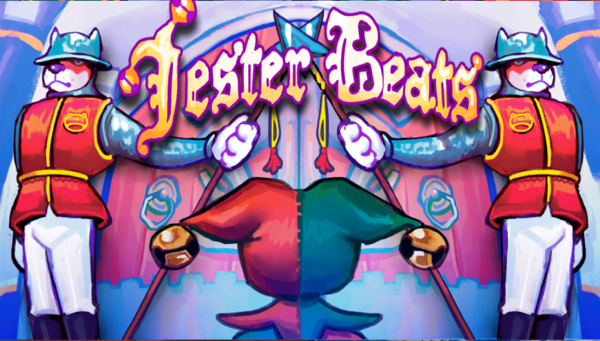
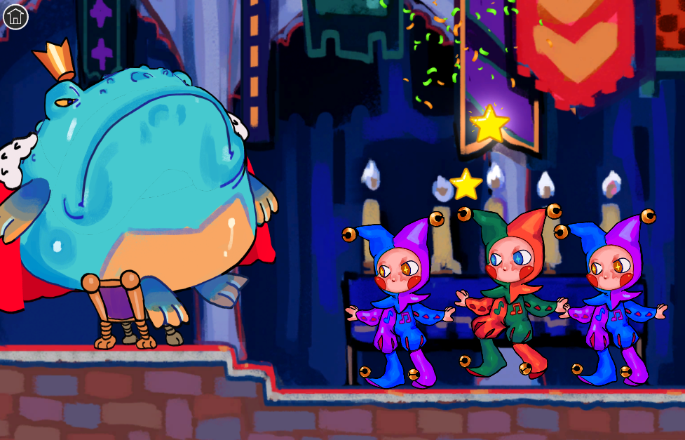

# GlobalGameJam2024

This is a 2D game created for the Global Game Jam 2024: [Jester Beats](https://globalgamejam.org/games/2024/jester-beats-8).

Enjoy this short musical game heavily inspired by Rythm Paradise!

# Play it

 - [Play it right here!](https://exantares.github.io/GlobalGameJam2024WebGL/)

# Plot
You're the king's jester. You and your team have been summoned to entertain his majesty. Unfortunately the invitation came too late to you and you didn't have time to rehearse the steps, so just follow the beats and trust your skills!

Eres el bufón del rey. Tú y tu equipo habéis sido convocados para entretener a su majestad. Por desgracia, la invitación te ha llegado demasiado tarde y no has tenido tiempo de ensayar los pasos, así que ¡sigue el ritmo y confía en tus habilidades!

# Controls
 - Space to follow the beats (A in controller, or just tap/click on the screen)

# Members
- [Ludovica Coratza (Animation)](https://www.instagram.com/ludo._.c/ "https://www.instagram.com/ludo._.c/")
- [Marta Alonso (Art)](https://martalongom99.wixsite.com/crims-art "https://martalongom99.wixsite.com/crims-art") - [Instagram](https://www.instagram.com/_crimsss_/ "https://www.instagram.com/_crimsss_/")
- [Oriana Laplana (GD/UX)](https://globalgamejam.org/users/oriana "https://globalgamejam.org/users/oriana")
- [Ciro Rodríguez LLorens (Audio)](https://www.instagram.com/ciro_rodriguez_ll "https://www.instagram.com/ciro_rodriguez_ll")
- [Luis Rojas (Programmer)](https://globalgamejam.org/users/antares "https://globalgamejam.org/users/antares")
- [Sergio Lumley (Programmer)](https://globalgamejam.org/users/sergio-lumley "https://globalgamejam.org/users/sergio-lumley")

